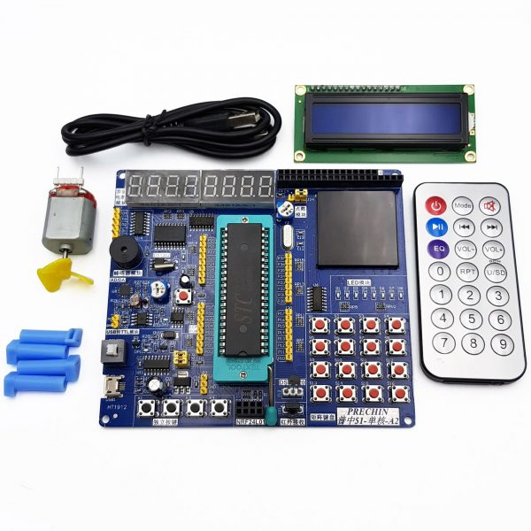

# Description

Bad apple played on 8051 pro with computer server.

* MCU: **STC89C52**
* Kit: **8051 Pro-KIT** (Schematic in `img` folder)



# Installation

## Requirements

* `SDCC` (Small Device C Compiler)
* `CMake` version 3.20 or higher

## Build

This program is supposed to be flashed into a microcontroller, not a computer. 

```bash
# Currently in bad-apple folder
cmake --preset=base
cmake --build build
```

The result file should be `build/bad-apple.ihx`.